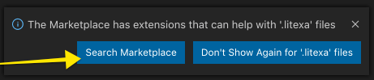

# Appendix: Editor Support

We have written a [Visual Studio Code (VS Code) extension](https://marketplace.visualstudio.com/items?itemName=litexa.litexa-syntax-highlighting) that supports syntax highlighting for files written in the Litexa
language for Alexa skills. Any such files will be denoted with the `.litexa` file extension.

## Installation

Visual Studio Code will prompt you to install the extension whenever you open a `.litexa` file. The dialog will look like this:

1. Click on "Search Marketplace"
1. It should find the extension called "Litexa Syntax Highlighting", click "Install"
1. That's it!

::: tip NOTE
Alternatively, you can also search the Visual Studio Marketplace within Visual Studio Code for `ext:litexa` or `litexa` and install from there.
:::

More info about the extension can be found at
[https://marketplace.visualstudio.com/items?itemName=litexa.litexa-syntax-highlighting](https://marketplace.visualstudio.com/items?itemName=litexa.litexa-syntax-highlighting)

## Manual Installation from Source

If you’d like to contribute to the extension or customize it for your own usage, you can locally install it from its source code:

1. Clone the [alexa-games/litexa](https://github.com/alexa-games/litexa) repository.
1. Copy or symlink the `litexa-vscode/litexa` directory to your
[VS Code extensions directory](#vs-code-extensions-directory).
1. Relaunch or reload VS Code.

::: tip Symlinking
The added benefit of using a symlink is being able to keep the extension up-to-date by running `git pull` on this project when a
new feature is launched.
:::

### VS Code Extensions Directory

Extensions are installed in a per-user extensions directory. Depending on your platform, the directory is located here:

* Windows `%USERPROFILE%\.vscode\extensions`
* macOS `~/.vscode/extensions`
* Linux `~/.vscode/extensions`

You can change the location by launching VS Code with the `--extensions-dir <dir>` command line option.

## Resources

* [Installing your VS Code Extensions Locally](https://vscode-docs.readthedocs.io/en/stable/extensions/example-hello-world/#installing-your-extension-locally)
* [Your VS Code Extensions Folder](https://vscode-docs.readthedocs.io/en/stable/extensions/install-extension/#your-extensions-folder)
